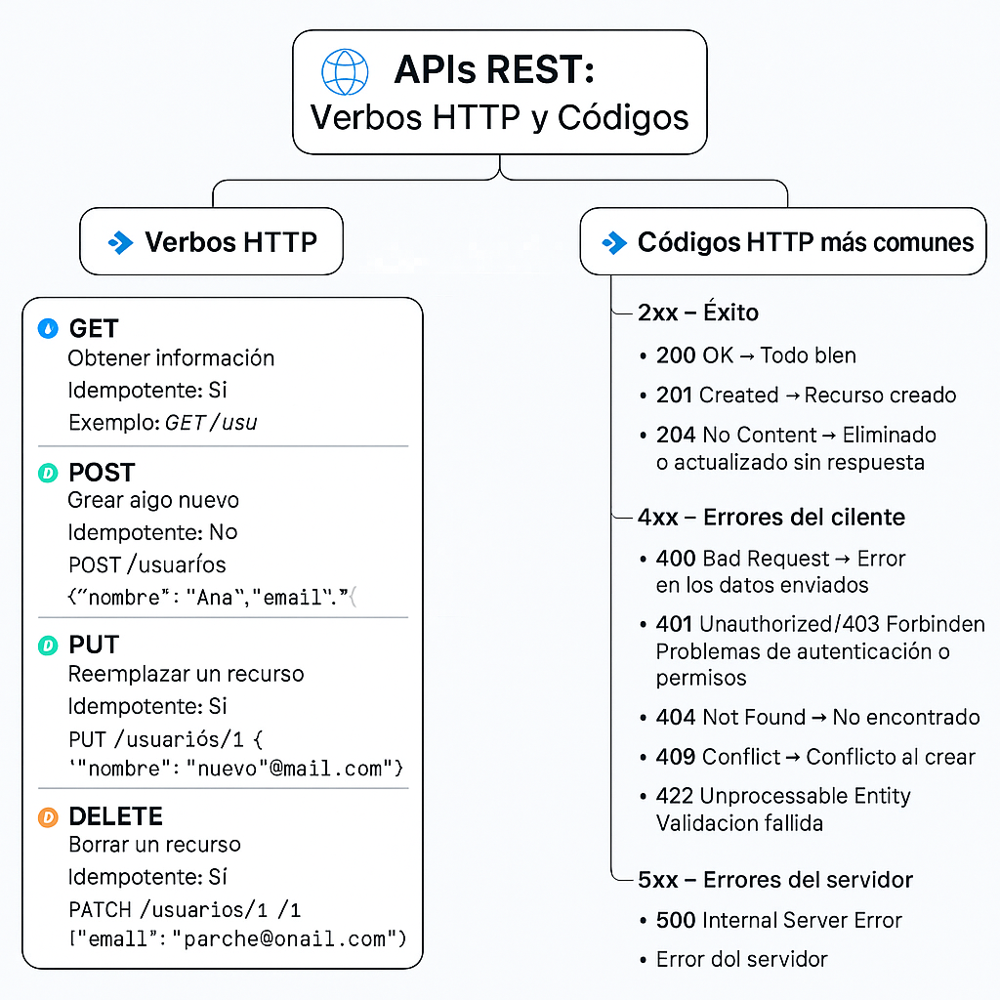

# Verbos y códigos en API Rest

# 📌 Verbos HTTP en REST (resumen rápido)

### 🔹 **GET**

- ✅ Obtiene recursos.
- ⚠️ No modifica nada.
- Ejemplo:
    
    ```
    GET /usuarios/1
    
    ```
    
    → Devuelve el usuario con ID=1.
    

---

### 🔹 **POST**

- ✅ Crea un recurso nuevo.
- ⚠️ No es idempotente (cada llamada puede crear algo distinto).
- Ejemplo:
    
    ```
    POST /usuarios
    {
      "nombre": "Ana",
      "email": "ana@mail.com"
    }
    
    ```
    
    → Crea un usuario.
    

---

### 🔹 **PUT**

- ✅ Reemplaza *todo* un recurso existente.
- ⚠️ Es idempotente (si lo repites, el resultado es el mismo).
- Ejemplo:
    
    ```
    PUT /usuarios/1
    {
      "nombre": "Ana",
      "email": "nuevo@mail.com"
    }
    
    ```
    
    → Sobrescribe los datos del usuario 1.
    

---

### 🔹 **PATCH**

- ✅ Modifica **parcialmente** un recurso.
- ⚠️ No siempre es idempotente.
- Ejemplo:
    
    ```
    PATCH /usuarios/1
    {
      "email": "parche@mail.com"
    }
    
    ```
    
    → Solo cambia el email del usuario 1.
    

---

### 🔹 **DELETE**

- ✅ Elimina un recurso.
- ⚠️ Idempotente (borrarlo varias veces deja el mismo resultado: no existe).
- Ejemplo:
    
    ```
    DELETE /usuarios/1
    
    ```
    
    → Borra el usuario con ID=1.
    

---

# 📊 Comparación rápida

| Verbo | Acción | Idempotente | Códigos comunes |
| --- | --- | --- | --- |
| GET | Leer | ✅ | 200, 404 |
| POST | Crear | ❌ | 201, 400, 409 |
| PUT | Reemplazar | ✅ | 200, 204, 404 |
| PATCH | Modificar parcial | ❌/✅ depende | 200, 204, 404 |
| DELETE | Borrar | ✅ | 200, 204, 404 |

## 🔹 Códigos HTTP más habituales en APIs REST

### **1xx – Informativos**

- 📌 Poco usados en APIs REST, se usan más a nivel de red.

---

### **2xx – Éxito**

| Código | Significado | Uso típico |
| --- | --- | --- |
| **200 OK** | Petición exitosa | `GET` de un recurso |
| **201 Created** | Recurso creado correctamente | `POST` para crear un usuario, producto, etc. |
| **202 Accepted** | Petición aceptada pero aún no procesada | Operaciones asíncronas |
| **204 No Content** | Éxito pero sin cuerpo en la respuesta | `DELETE` o `PUT` |

---

### **3xx – Redirecciones**

| Código | Significado | Uso típico |
| --- | --- | --- |
| **301 Moved Permanently** | El recurso se movió de forma definitiva | Redirección de endpoint |
| **302 Found** | Redirección temporal | Ejemplo: login |
| **304 Not Modified** | El recurso no cambió (cache) | Usado con cabeceras `ETag` o `If-Modified-Since` |

---

### **4xx – Errores del cliente**

| Código | Significado | Uso típico |
| --- | --- | --- |
| **400 Bad Request** | Petición mal formada | JSON inválido, parámetros incorrectos |
| **401 Unauthorized** | No autenticado | Falta o token inválido |
| **403 Forbidden** | Autenticado pero sin permisos | Acceso denegado a un recurso |
| **404 Not Found** | Recurso no existe | `GET /usuarios/999` |
| **405 Method Not Allowed** | Verbo HTTP no permitido | `DELETE` en un endpoint que solo soporta `GET` |
| **409 Conflict** | Conflicto en la petición | Crear un recurso que ya existe |
| **422 Unprocessable Entity** | Datos correctos en formato, pero inválidos en lógica | Validaciones fallidas en un formulario |
| **429 Too Many Requests** | Límite de peticiones superado | APIs con *rate limit* |

---

### **5xx – Errores del servidor**

| Código | Significado | Uso típico |
| --- | --- | --- |
| **500 Internal Server Error** | Error genérico en el servidor | Fallo inesperado |
| **502 Bad Gateway** | Error de comunicación entre servidores | API detrás de un proxy/gateway |
| **503 Service Unavailable** | Servicio caído o en mantenimiento | Servidor sobrecargado |
| **504 Gateway Timeout** | El servidor no respondió a tiempo | Timeout en servicios intermedios |

---

## 🔹 Resumen rápido de los más usados en REST

- **200** → Todo bien ✅
- **201** → Creado
- **204** → Eliminado o actualizado sin cuerpo
- **400** → Error de cliente (mal request)
- **401** → No autenticado
- **403** → No autorizado (sin permisos)
- **404** → No encontrado
- **409** → Conflicto
- **422** → Datos inválidos
- **500** → Error en servidor



<br>

# Postman
¡Perfecto! Vamos a enriquecer los apuntes que ya te di agregando **ejemplos prácticos usando la extensión de Postman en VSCode** debajo de cada apartado relevante.

---

# **Apuntes de Postman (con ejemplos en VSCode)**

## **1. Qué es Postman**
¡Perfecto! Te voy a preparar unos **apuntes completos y bien explicados sobre Postman**, desde lo básico hasta conceptos un poco más avanzados. Los organizaré en secciones para que sea fácil de estudiar.

---

# **Apuntes de Postman**

## **1. Qué es Postman**

Postman es una herramienta que permite **probar, desarrollar y documentar APIs** (Interfaces de Programación de Aplicaciones).
Es muy utilizada por desarrolladores para:

* Enviar solicitudes HTTP a un servidor.
* Probar APIs sin necesidad de crear un frontend.
* Automatizar pruebas de APIs.
* Documentar endpoints para que otros desarrolladores los entiendan.

**Ventajas de Postman:**

* Interfaz intuitiva y visual.
* Soporta todos los métodos HTTP (GET, POST, PUT, DELETE, PATCH…).
* Permite agregar encabezados, parámetros, cuerpos de solicitud y autenticación.
* Facilita la creación de colecciones de pruebas y ambientes.

## **2. Conceptos básicos**

### **2.1 Solicitudes (Requests)**

Tipos de solicitudes HTTP más comunes:

| Método | Uso                                 | Ejemplo en Postman VSCode                                                                         |
| ------ | ----------------------------------- | ------------------------------------------------------------------------------------------------- |
| GET    | Obtener información                 | `http GET https://api.ejemplo.com/usuarios`                                                       |
| POST   | Crear un recurso nuevo              | `http POST https://api.ejemplo.com/usuarios Content-Type: application/json {"nombre":"Juan"} `    |
| PUT    | Actualizar completamente un recurso | `http PUT https://api.ejemplo.com/usuarios/1 Content-Type: application/json {"nombre":"Carlos"} ` |
| PATCH  | Actualizar parcialmente un recurso  | `http PATCH https://api.ejemplo.com/usuarios/1 Content-Type: application/json {"nombre":"Luis"} ` |
| DELETE | Eliminar un recurso                 | `http DELETE https://api.ejemplo.com/usuarios/1`                                                  |

> En la extensión de VSCode, puedes crear un archivo `.http` o `.rest` y escribir directamente estas solicitudes.


### **2.2 Componentes de una solicitud en Postman**

1. **URL**: `https://api.ejemplo.com/usuarios`
2. **Método HTTP**: GET, POST, PUT, PATCH, DELETE
3. **Headers (Encabezados)**

Ejemplo de header en VSCode:

```http
GET https://api.ejemplo.com/usuarios
Authorization: Bearer {{token}}
Content-Type: application/json
```

4. **Params (Parámetros)**

Ejemplo con parámetros en la URL:

```http
GET https://api.ejemplo.com/usuarios?edad=25&pais=MX
```

5. **Body (Cuerpo)**

Ejemplo en POST:

```http
POST https://api.ejemplo.com/usuarios
Content-Type: application/json

{
  "nombre": "Ana",
  "edad": 30
}
```

6. **Authorization**

Ejemplo usando Bearer Token:

```http
GET https://api.ejemplo.com/perfil
Authorization: Bearer {{token}}
```

### **2.3 Colecciones**

En VSCode, no existe el concepto visual de “colección” como en la app de Postman, pero puedes **organizar archivos `.http` por carpetas** para simular colecciones.

Ejemplo:

```
/APIUsuarios
   ├─ getUsuarios.http
   ├─ postUsuario.http
   └─ deleteUsuario.http
```

### **2.4 Environments (Ambientes)**

Se usan variables dentro de las solicitudes.

Ejemplo de variable en VSCode:

```http
GET {{url_base}}/usuarios/{{id_usuario}}
```

Luego defines en VSCode un archivo `.env` o un bloque de variables al inicio del `.http`:

```http
@url_base = https://api.ejemplo.com
@id_usuario = 1
```


### **2.5 Tests (Pruebas)**

En VSCode puedes usar la sintaxis de Postman con JavaScript en un bloque `### Test` dentro del `.http`:

```http
GET https://api.ejemplo.com/usuarios/1

### Test
pm.test("Estado es 200", function () {
    pm.response.to.have.status(200);
});
pm.test("Nombre es Juan", function () {
    var jsonData = pm.response.json();
    pm.expect(jsonData.nombre).to.eql("Juan");
});
```

### **2.6 Variables en Postman**

Ejemplo en VSCode usando variables:

```http
GET {{url_base}}/usuarios/{{id_usuario}}
```

Archivo de variables:

```http
@url_base = https://api.ejemplo.com
@id_usuario = 42
```

## **3. Flujo típico de uso en Postman VSCode**

1. Crear un archivo `.http` por cada endpoint.
2. Configurar variables con `@nombre_variable`.
3. Escribir la solicitud con método, URL, headers y body.
4. Ejecutar la solicitud (Click en “Send Request” desde VSCode).
5. Revisar la respuesta en el panel de resultados.
6. Guardar el archivo `.http` en una carpeta por proyecto.
7. Agregar tests al final de cada solicitud si se necesita.

## **4. Tips avanzados**

* **Pre-request scripts:** Se pueden simular usando bloques de variables dinámicas en VSCode.
* **Monitors:** No aplica directamente en VSCode; requiere Postman web/app.
* **Documentación automática:** En VSCode se puede comentar cada archivo `.http` con descripciones de los endpoints.

